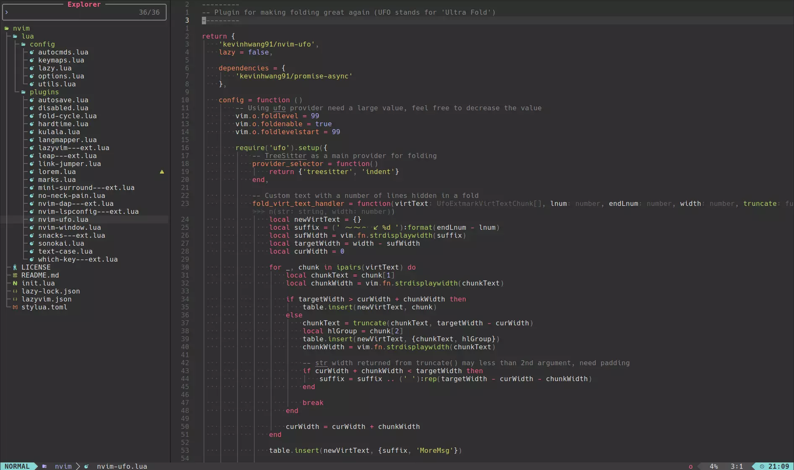

# Neovim config based on 💤 LazyVim

A Neovim config for web development (PHP, JS) based on [LazyVim](https://github.com/LazyVim/LazyVim) and includes a bunch of tweaks for improving developer experience as I see it.

## Requirements

- Neovim >= 0.10.0

## Third-party dependencies

1. [Node adapter](https://github.com/xdebug/vscode-php-debug) for debugger plugin;
2. [RipGrep (rg)](https://github.com/BurntSushi/ripgrep) tool version 14+ for [Grug](https://github.com/MagicDuck/grug-far.nvim) plugin, that is used for search stuff inside files;
3. [Improved find tool **fd**](https://github.com/sharkdp/fd) for fast file searching. It is used by [Telescope.nvim](https://github.com/nvim-telescope/telescope.nvim) plugin.

## What is included

TODO: will fill this section someday...
